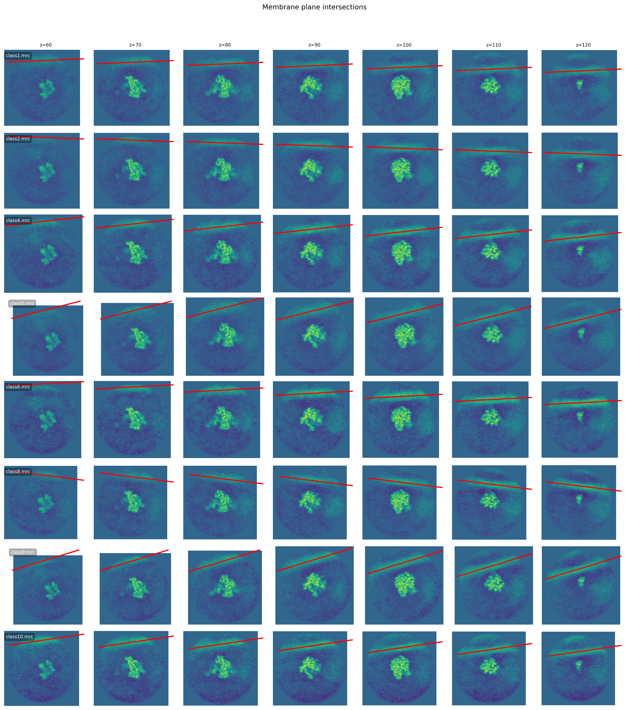
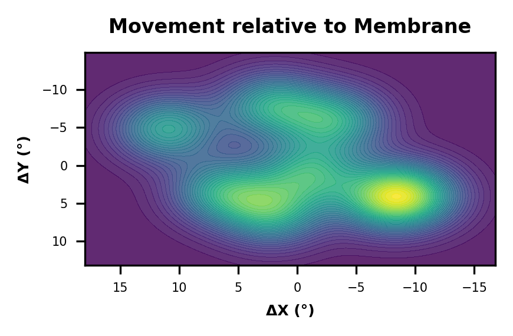

# Chlororibo Cryo-ET

Jupyter notebooks for ribosome-membrane orientation and polysome organization analysis used in [Chloroplast-encoded small subunit extensions reshape the Chlamydomonas chlororibosome](https://pubmed.ncbi.nlm.nih.gov/41727112/).

## Workflows

### 1. Ribosome movement relative to membrane

Notebook: `ribomove/ribocone.ipynb`

Main steps:
- detect membrane density in an annular region of each class volume
- fit the in-plane membrane direction by PCA
- estimate through-plane membrane tilt across Z-slices
- project 3D normal deviations onto a 2D tangent plane
- plot membrane plane intersections and angular deviation density

<p align="left">
  
  
</p>

### 2. Polysome detection from RELION particles

Notebook: `polysome/poly.ipynb`

Main steps:
- read ribosome coordinates and angles
- build candidate ribosome-ribosome edges using KDTree distance search
- filter neighbors by center-to-center distance and SO(3) orientation similarity
- keep connected components with degree ≤ 2 (no ribosome in a polysome can have three neighbors)
- plot tomogram map-backs, selected polysome examples, and chain-length distributions

<p align="left">
  
</p>

## Requirements

```text
numpy
pandas
matplotlib
scipy
starfile
mrcfile
jupyter
```

## Usage

Open the notebooks in Jupyter and edit the parameter block at the top of each notebook:

```bash
jupyter notebook ribomove/ribocone.ipynb
jupyter notebook polysome/poly.ipynb
```

## License

MIT
